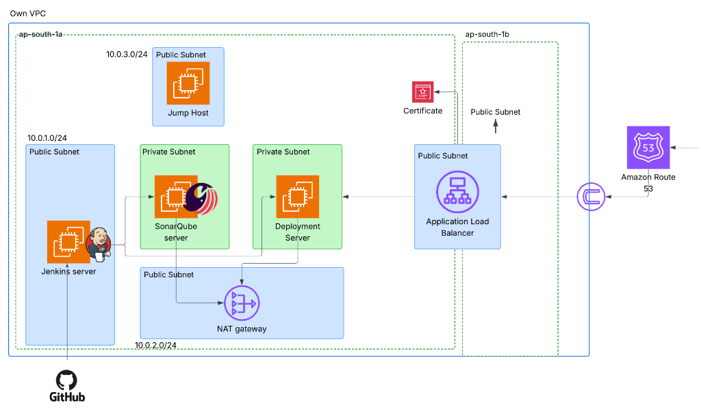
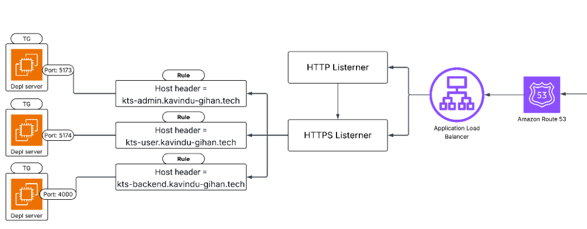

# University Bus Travel Ticket System - Infrastructure

This repository contains the infrastructure and configuration code for the **University Bus Travel Ticket System**, a comprehensive MERN stack application designed to modernize campus transportation.

## 📌 Project Overview

The system features a responsive interface, secure JWT authentication, and real-time notifications. It serves:

- **Administrators**: To manage bus routes and schedules.
- **Students**: To browse routes, purchase tickets, and validate travel via QR codes.

This infrastructure repository ensures a **fully automated, secure, and scalable** deployment on **AWS**.

## 🏗️ Architecture

The infrastructure is built using **Terraform** for provisioning and **Ansible** for configuration management. It implements a secure CI/CD pipeline.

### High-Level Architecture

- **Cloud Provider**: AWS
- **Infrastructure as Code**: Terraform
- **Configuration Management**: Ansible
- **CI/CD**: Jenkins, SonarQube, Docker
- **Networking**: VPC with Public/Private subnets, NAT Gateway, Jump Host
- **Access**: Route 53, Application Load Balancer (ALB), SSL

### System Diagrams

#### Network Architecture



#### Deployment Pipeline



---

## 📂 Repository Structure

```
.
├── infra/                 # Terraform configuration files (VPC, EC2, ALB, etc.)
├── configure/             # Ansible playbooks/inventory for server configuration
├── depl_server_config/    # Deployment webhook server (Node.js) configuration
├── assets/                # Architecture diagrams
```

---

## 🚀 Getting Started

### Prerequisites

- [AWS CLI](https://aws.amazon.com/cli/) configured with appropriate permissions.
- [Terraform](https://www.terraform.io/) installed.
- [Ansible](https://www.ansible.com/) installed.
- SSH Key pair for the Jump Host.

### 1. Provision Infrastructure (Terraform)

Initialize and apply the Terraform configuration to create the AWS resources.

```bash
cd infra
terraform init
terraform plan
terraform apply
```

### 2. Configure Servers (Ansible)

Once the infrastructure is ready, update the `inventory.ini` file in the `configure/` directory with the new IP addresses (Jump Host, Jenkins, SonarQube, Deployment Server).

Run the Ansible playbooks to configure the services:

```bash
cd configure

# Example: Configure SonarQube
ansible-playbook -i inventory.ini configure_sonaq.yaml

# Example: Configure Jenkins
ansible-playbook -i inventory.ini configure_jenkins_install_jenkins.yaml
```

---

## 🔐 Accessing Internal Services

Services like **SonarQube** and **Jenkins** may be deployed in private subnets for security. To access them from your local machine, use **SSH Port Forwarding** via the Jump Host.

**Example SSH Tunnel Command:**

```bash
ssh -i ~/.ssh/<your_key> -L 9000:<internal_service_ip>:9000 ubuntu@<jump_host_public_ip>
```

_Replace `<internal_service_ip>` with the private IP of the service (e.g., SonarQube) and `<jump_host_public_ip>` with the Jump Host's public IP._

---

## 🔄 CI/CD Pipeline

The continuous integration and deployment pipeline is automated using Jenkins and GitHub Webhooks.

1.  **Push**: Developers push code to the `main` branch.
2.  **Build & Test**: Jenkins triggers a build, runs tests, and builds Docker images.
3.  **Analysis**: Code is analyzed by **SonarQube** for quality gates.
4.  **Deploy**: Upon passing checks, a webhook triggers the **Deployment Server** to pull the new images and restart containers.
